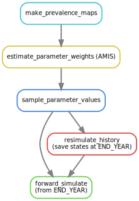

### Description

This is a [snakemake](https://snakemake.readthedocs.io/en/stable/)
workflow implementing the fitting pipeline for the NTDMC trachoma
model. Starting from geostatistical infection data, this workflow
simulates spread of trachoma for an (statistical) ensemble of
infection parameter values, for each implementation unit present in
the original data.

The simplified workflow can visualised as:



In practice, the workflow splits the IUs into groups processed in
parallel.  IUs are grouped together according to values of first MDA
year, last MDA year, mean prevalence level. For instance, IU subset
(`first_mda`=2008, `last_mda`=2019, `level`=3) groups together IUs for
which the first MDA occurs in year 2008, the last MDA in year 2019,
and for which the mean infection prevalence is between 20% and 30%
(assuming a prevalence level spans a 10% prevalence range).

A more accurate visualisation of the workflow is therefore, with 3 IU
groups:


### Installation

You'll need 
- A Python 3.8+ installation with the `scipy` and `pandas` packages availabe.
- A R installation with the [trachomAMIS
  package](https://github.com/OxfordRSE/trachomAMIS) available.

For instance, you could install the miniconda python distribution and
create a `trachoma` environment:
```shell
(base) $ conda create --name trachoma scipy pandas
```
Then, install snakemake in the `trachoma` environment
```shell
(base) $ conda activate trachoma
(trachoma) $ pip install snakemake
```

Finally, install the trachomAMIS R package

```R
devtools::install_github("OxfordRSE/trachomAMIS")
```

### Usage

To execute the pipeline for all IU subsets in the input data, run
```shell
snakemake --cores N 
```

replacing `N` by the number of cores available. As much as possible,
depending on the number of available cores, subsets of IUs will be
processed in parallel.

It is possible to process individual subsets, for instance

```shell
snakemake --cores 4 data/model_output_2008_2019_level_3
```

Or several of them (using bash shell brace expansion notation)
```shell
snakemake --cores 4 data/model_output_{2008_2019_level_3,2008_2017_level_2}
```
### Under the hood

