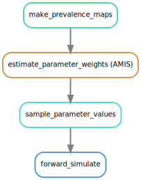

.. NTDMC inference pipeline documentation master file, created by
   sphinx-quickstart on Tue Jul  4 11:06:51 2023.
   You can adapt this file completely to your liking, but it should at least
   contain the root `toctree` directive.

NTDMC inference pipeline
========================

The NTDMC inference and simulation pipeline implements a workflow for
the simulation of epidemiological models for an ensemble of
geographical locations.  For each location, model parameters are
inferred from available epidemiological statistics (e.g. mean disease
prevalence), using Adaptive Multilevel Importance Sampling (AMIS).

At a high-level, the workflow can be represented as:

The pipeline is implemented as a Snakemake workflow.

.. toctree::
   :maxdepth: 2
   :caption: Contents:

   install
   quickstart
